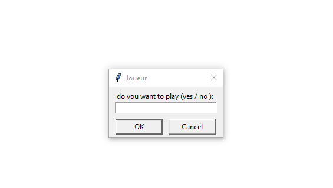
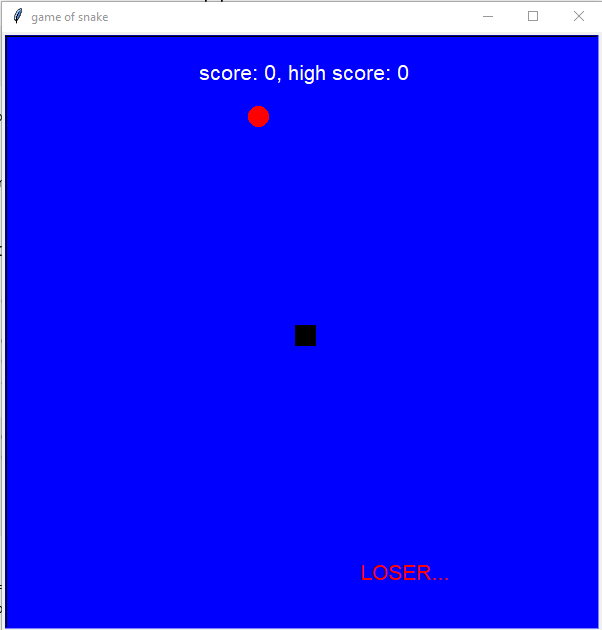
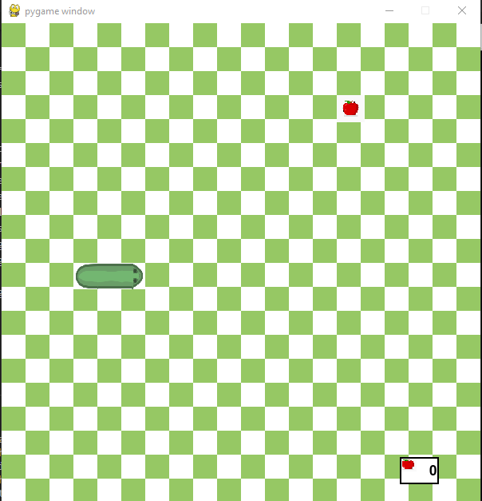

[![LinkedIn][linkedin-shield]][linkedin-url]

## snake game
The Snake game is a classic arcade game that has captivated players for decades. In this game, the player controls a snake that moves around the screen, consuming food to grow longer. The objective is to eat as much food as possible without colliding with the walls of the game area or running into itself.

## tmplates from game 

## to use the project 
>> pip install pygame  
>> pip install turtle

<!-- MARKDOWN LINKS & IMAGES -->
[linkedin-shield]: https://img.shields.io/badge/-LinkedIn-black.svg?style=for-the-badge&logo=linkedin&colorB=555
[linkedin-url]:https://www.linkedin.com/in/fatiha-laaouafi-4227252ba/
